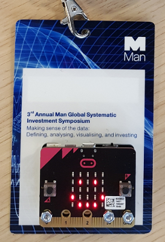
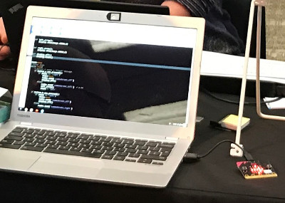
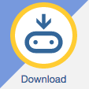

If you have a name badge from the 3rd Annual Man Global Systematic
Investment Symposium, you can run Python programs on it! It's really a
tiny computer called a [micro:bit](http://microbit.org/).

This repository contains an [example program](badge.py) and instructions to
help you get started.

Here at Man AHL, we use Python to build systematic trading strategies,
although we use slightly bigger computers.

## Getting Started

You will need:

* A computer
* Your micro:bit
* A micro USB cable

1. Connect the micro:bit to your laptop with the micro USB cable.

2. Open [the python editor](http://python.microbit.org/editor.html) in
   a web browser.
   
3. Copy
   [the example program here](badge.py) into
   the editor.
   
4. Click the download button, which looks like this:

5. Save the file to your micro:bit. Your micro:bit works just like a
   USB stick, so your computer should show your micro:bit as a
   directory to save to.
   
6. Your microbit will show a yellow flashing light whilst the program
   is loaded. Wait with baited breath.
   
7. You should now see your program running on the micro:bit!

### Next Steps

Try making changes to the program. Save the new version to your
micro:bit -- does it work?

If you're looking for some ideas, you might like to
try [a dice](https://microbit-micropython.readthedocs.io/en/latest/tutorials/random.html#random-numbers),
[ticklish python](https://microbit-micropython.readthedocs.io/en/latest/tutorials/io.html#ticklish-python) or
a [magic-8 ball](https://microbit-micropython.readthedocs.io/en/latest/tutorials/gestures.html#magic-8).

## Resources

If you get stuck, there's a wealth of information on
the [official micro:bit site](http://microbit.org/). You may also find
the
[micropython documentation](http://microbit-micropython.readthedocs.io) helpful.

## License

MIT license.
